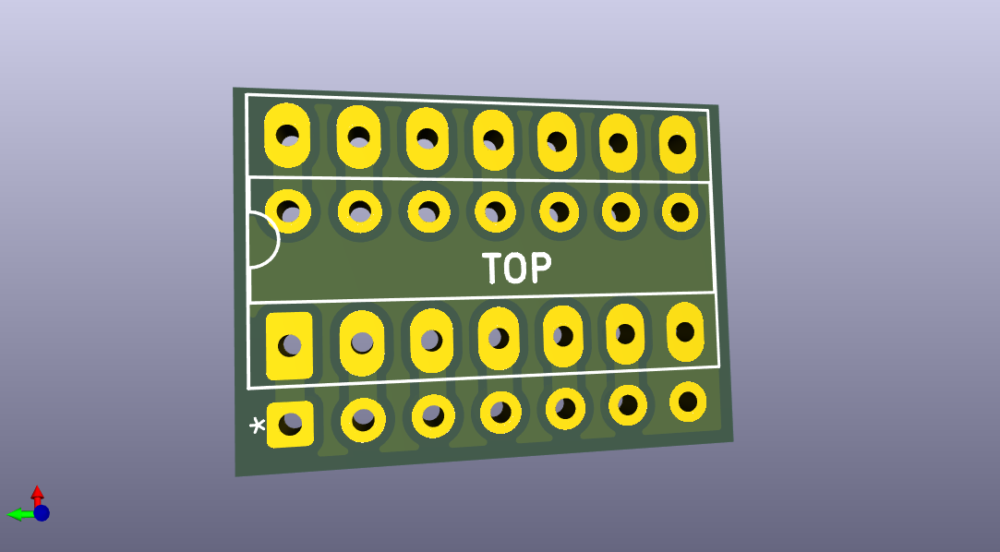

# Omega Mainboard 1.4 JoyFix Board

This is an interposer board that fixes the existing bug in the joystick circuit of the Omega Mainboard 1.4.

# The standard MSX joystick circuit

The MSX specification requires that compatible computers provide one or two joystick ports. Nevertheless, most MSX computers have two joystick ports.

The MSX joystick ports are controlled by an AY-3-8910 (or compatible) chip, called the PSG (Programmable Sound Generator). This chip has two general I/O ports IOA and IOB to interface with a micro-processor. In the case of the MSX, IOB is used as OUTPUT and mapped to register #15 of PSG, and IOA is used as INPUT and mapped to register #14 of PSG.

||
|:--|
|MSX Joystick Circuit Diagram|

In the diagram:
- J3 represents joystick port 1
- J4 represents joystick port 2

Each one of the joystick ports has the following pinout:
- 4x INPUT signals
  - pin 1:UP
  - pin 2:DOWN
  - pin 3:LEFT
  - pin 4:RIGHT
- 2x INPUT/OUTPUT signals
  - pin 6:TRIGGER A
  - pin 7:TRIGGER B
- 1x OUTPUT signal
  - pin 8:OUTPUT
- 2x POWER lines
  - pin 5: +5V
  - pin 9: GND

INPUT signals and the input side of INPUT/OUTPUT signals are pulled up by default (making them logical "1" while floating).

The output side of INPUT/OUTPUT signals are buffered with open-collector buffers (74LS07), which leave the outputs floating on logical input "1" and pulled down on logical input "0".

The OUTPUT signal is a push-pull signal, so the output does not float and it is always set to logical "0" or "1".

## IOB I/O port (PSG register #15, OUTPUT) ##

IOB bit 0 controls the output logical level of TRIGGER A (pin 6) of joystick port 1.

IOB bit 1 controls the output logical level of TRIGGER B (pin 7) of joystick port 1.

IOB bit 2 controls the output logical level of TRIGGER A (pin 6) of joystick port 2.

IOB bit 3 controls the output logical level of TRIGGER B (pin 7) of joystick port 2.

IOB bit 4 controls the output logical level of OUTPUT (pin 8) of joystick port 1.

IOB bit 5 controls the output logical level of OUTPUT (pin 8) of joystick port 2.

IOB bit 6 controls which joystick is read ("0" for joystick port 1 and "1" for joystick port 2) as it is connected directly to the Select signal (pin 1) of two 74LS157 quad 2-input multiplexers used to select between the signals of each joystick port.

## IOA I/O port (PSG register #14, INPUT) ##

IOA bits read the status of the direction arrows and triggers of the joysticks. A "1" indicates an inactive arrow/trigger, and a "0" indicates a pressed arrow/trigger.

Before reading an arrow/trigger of a specific joystick, IOB bit 6 must be set accordingly to select the proper joystick port ("0" for port 1, "1" for port 2).

In addition, due to the electrical characteristics of the MSX joystick circuit, reading the trigger buttons input side from IOA require making sure that the output side of IOB is set to "1" before (to avoid pulling down/clobbering the signal).
- In order to read TRIGGER A (bit 4 of IOA) of joystick port 1, one needs to write "1" to bit 0 of IOB.
- In order to read TRIGGER B (bit 5 of IOA) of joystick port 1, one needs to write "1" to bit 1 of IOB.
- In order to read TRIGGER A (bit 4 of IOA) of joystick port 2, one needs to write "1" to bit 2 of IOB.
- In order to read TRIGGER B (bit 5 of IOA) of joystick port 2, one needs to write "1" to bit 3 of IOB.

IOA bit 0 reads the status of the UP arrow.

IOA bit 1 reads the status of the DOWN arrow.

IOA bit 2 reads the status of the LEFT arrow.

IOA bit 3 reads the status of the RIGHT arrow.

IOA bit 4 reads the status of the TRIGGER A button.

IOA bit 5 reads the status of the TRIGGER B button.

# The Problem

As described in the [MRC](https://www.msx.org) hardware forum, @PaxNL discovered an [issue](https://www.msx.org/forum/msx-talk/hardware/msxmakers-support?page=17) with [Super Sokoban](https://www.msxdev.org/2025/01/28/msxdev24-28-super-sokoban/) when trying to play the game with a joystick on the [Omega Home Computer](https://github.com/skiselev/omega).

The game uses the [MSXgl](https://aoineko.org/msxgl/index.php?title=Modules/input) library device detection feature which uses a [MSX-HID](https://www.msx.org/wiki/MSX-HID)-like device fingerprinting to support joysticks and other input devices.

The detection uses OUTPUT (pin 8) of the [joystick port](https://www.msx.org/wiki/General_Purpose_port) to generate a 3-cycle LOW-HIGH-LOW signal. At each of those cycles the low order bits 0-5 of PSG register #14 are read and a fingerprint is calculated based on the results of the 3-cycle reads. The generated fingerprint (hopefully) identifies the connected device type, and from there the proper I/O protocol is used to read/write data to the connected device (which may include using the trigger ports as outputs).

While troubleshooting the issue, @PaxNL and @Arjan determined by looking at the joystick port readouts that there was a problem with the joystick I/O: TRIGGER B on joystick port 1 and TRIGGER A on joystick port 2 were always detected as pressed when the game was run on the Omega Home Computer.

After a deeper analysis with the help of @aoineko, the author of MSXgl, it was determined that there was an implementation bug in the Omega Home Computer joystick circuit diagram which caused exactly that behavior as a result of the software interaction with the buggy hardware.

# The Omega mainboard 1.4 joystick circuit

As can be seen on the depicted diagram, the Omega Home Computer PSG circuit tries to mimic the standard MSX joystick circuit, but has a subtle implementation flaw.

Some useful signal mappings to understand the circuit:
- JB0 signal maps to IOB0 signal
- JB1 signal maps to IOB1 signal
- JB2 signal maps to IOB2 signal
- JB3 signal maps to IOB3 signal

If we look closely at the connection of the trigger output signals to the open-collector buffer inputs and the connection of the open-collector buffer outputs to the joystick port signals we can see that:
- :white_check_mark: the output of the open-collector buffer corresponding to signal JB0 (IOB0) is connected to joystick port 1 trigger A (TRG1_A)
- :x: the output of the open-collector buffer corresponding to signal JB1 (IOB1) is incorrectly connected to joystick port 2 trigger A (TRG1_B)
- :x: the output of the open-collector buffer corresponding to signal JB2 (IOB2) is incorrectly connected to joystick port 1 trigger B (TRG2_A)
- :white_check_mark: the output of the open-collector buffer corresponding to signal JB3 (IOB3) is connected to joystick port 2 trigger B (TRG2_B)

Exactly the two signals that were incorrectly read (joystick port 2 trigger A and joystick port 1 trigger B) are the signals that are incorrectly wired.

The incorrect wiring is probably caused by the confusing naming convention used for the trigger signal labels which is prone to errors (TRGx_y means trigger x of joystick y, with y=A|B and x=1|2).

# The fix

The circuit can be easily fixed by re-routing the affected signals to make them available at the right place.

In the Omega Mainboard 1.4 joystick circuit we have the following connections related to the triggers, taking into account the functional pinout of the [74LS07](https://www.ti.com/lit/ds/symlink/sn74ls07.pdf):
- input `Pin 11` of U42 (connected to JB2/IOB2) outputs to `Pin 10` of U42 (incorrectly connected to joystick port 1 trigger B, aka TRG2_A)
- input `Pin 13` of U42 (connected to JB1/IOB1) outputs to `Pin 12` of U42 (incorrectly connected to joystick port 2 trigger A, aka TRG1_B)

A clean and easy approach to fix the circuit is to use an interposer board at U42 (74LS07 open-collector buffer) that performs the needed re-mapping of signals.

The idea of the interposer board was brought up by Ludo and shared on [issue #56](https://github.com/skiselev/omega/issues/56) of the [Omega github page](https://github.com/skiselev/omega) where you can see a photo of his CNC fabricated interposer board.

So to re-route the signals to match the MSX standard joystick circuit we can map the U42-original signals to a new set of U42-interposed signals (where the 74LS07 will be actually connected), like this:
- Connect `Pin 10 of U42-interposed` (buffered output of Pin 11 of U42-interposed which connects to JB2/IOB2) to `Pin 12 of U42-original` (connected to joystick port 2 trigger A, aka TRG1_B), so that Pin 11 of U42-original (JB2/IOB2) outputs to Pin 12 of U42-original (joystick port 2 trigger A) ( `yellow` path on the diagram)
- Connect `Pin 12 of U42-interposed` (buffered output of Pin 13 of U42-interposed which connects to JB1/IOB1) to `Pin 10 of U42-original` (connected to joystick port 1 trigger B, aka TRG2_A), so that Pin 13 of U42-original (JB1/IOB1) outputs to Pin 10 of U42-original (joystick port 1 trigger B) ( `green` path on the diagram)
- Connect all other Pins of U42-interposed to the same Pins of U42-original (i.e Pin 1 to Pin 1, Pin 2 to Pin 2, etc.) ( solid `pink` paths on the diagram)

Summarizing, after the re-routing we have fixed the issue:
- `Pin 11 of U42-original` (connected to JB2/IOB2) outputs to `Pin 12 of U42-original` (connected to joystick port 2 trigger A)
- `Pin 13 of U42-original` (connected to JB1/IOB1) outputs to `Pin 10 of U42-original` (connected to joystick port 1 trigger B)

And the complete trigger connection diagram matches now the original MSX joystick circuit diagram:
- :white_check_mark: the output at the open-collector buffer corresponding to signal JB0 (IOB0) is connected to joystick port 1 trigger A (TRG1_A)
- :white_check_mark: the output at the open-collector buffer corresponding to signal JB1 (IOB1) is connected to joystick port 1 trigger B (TRG2_A)
- :white_check_mark: the output at the open-collector buffer corresponding to signal JB2 (IOB2) is connected to joystick port 2 trigger A (TRG1_B)
- :white_check_mark: the output at the open-collector buffer corresponding to signal JB3 (IOB3) is connected to joystick port 2 trigger B (TRG2_B)

# Hardware

## [Omega-1.4-U42-joyfix-v1-Build1](hardware/kicad/omega-1.4-joyfix-board-Build1/)

:white_check_mark: This board has been successfully built and tested.

[Bill Of Materials (BoM)](https://html-preview.github.io/?url=https://raw.githubusercontent.com/herraa1/omega-1.4-joyfix-board-v1/main/hardware/kicad/omega-1.4-joyfix-board-v1-Build1/bom/ibom.html)

[Schematic and PCB](https://kicanvas.org/?github=https%3A%2F%2Fgithub.com%2Fherraa1%2Fomega-1.4-joyfix-board-v1%2Ftree%2Fmain%2Fhardware%2Fkicad%2Fomega-1.4-joyfix-board-v1-Build1)

## PCB Manufacturing tips

As the joyfix board is super small, some PCB manufacturers may make extra charges when building standalone prototypes or panelizing the boards using v-cuts.

One way to avoid the extra costs is panelizing the joyfix board using "mouse bites".

# Build instructions

## Required materials

* 2x 2.54mm pitch male-male header L10 7P
* 1x DIP14 circular IC socket

## Step by step instructions

1. Determine the large pad side of the 7P headers.

2. Temporarily insert the two 7P headers into the DIP14 circular IC socket to perfectly align the headers before soldering them to the joyfix board PCB.

You need to insert the headers so that the large pad side stays on the top, and the small pads side is inserted into the socket.

3. Insert the PCB into the two 7P headers using the small circular pads, making sure the PCB top mark remains at the top.

4. Solder the headers to the PCB from the top side and then remove the DIP14 IC socket (it was used temporarily just for alignment purposes).

5. Trim the headers on the top side to avoid interfering with the DIP14 IC socket when installed permanently.

6. Insert the DIP14 IC socket into the large pads of the PCB from the top side in preparation for soldering.

7. Solder the DIP14 IC socket to the joyfix board PCB from the bottom side, making sure you don't accidentally touch the header plastics while soldering.

8. Clean the board with 99.9% Isopropyl Alcohol (IPA) and proceed to installation.

# Installation instructions

## Step by step instructions

1. Locate the U42 74LS07 IC chip on the Omega Home Computer.

It is a DIP14 IC available near the joystick port 2.

2. Remove the 74LS07 chip from the U42 socket, insert it into the joyfix board socket, and then insert the joyfix board into the U42 socket.

Respect the IC notch markings when orienting both the 74LS07 and the joyfix board for insertion.

Make sure you properly align the joyfix board header pins to the U42 socket to make a good insertion without damaging the U42 socket.

# Validating the fix

The [MSXJIO](https://github.com/louthrax/MSXJIO) project by @Louthrax is a fun way to test that the Omega mainboard 1.4 joystick hardware bug is gone when using the joyfix board.

You will need:
- A MSX JIO client in ROM format like JMSXDOS1.rom available in [JIO_Client_MSXDOS1_1_0.zip ](https://github.com/louthrax/MSXJIO/releases)
- A DSK image of your choice
- A MSX JIO compatible hardware as described in the [hardware section](https://github.com/louthrax/MSXJIO?tab=readme-ov-file#hardware) of the MSXJIO project.
- A [MSX JIO server](https://github.com/louthrax/MSXJIO?tab=readme-ov-file#server-details) for your operating system of choice

See the MSXJIO project for additional [details and instructions](https://github.com/louthrax/MSXJIO?tab=readme-ov-file#msxjio).

The idea is to flash the MSX JIO client ROM to a ROM cartridge (for example, the [RISKYMSX](https://github.com/arkadiuszmakarenko/RISKYMSX)), connect the MSX JIO hardware between your PC and MSX, start the MSX JIO server on your PC with your DSK of choice selected, and boot your MSX with the MSX JIO client ROM. The MSX will boot and use the DSK in your PC as a mass storage device. Coolio!

## Omega 1.4 without the joyfix board

## Omega 1.4 with the joyfix board

